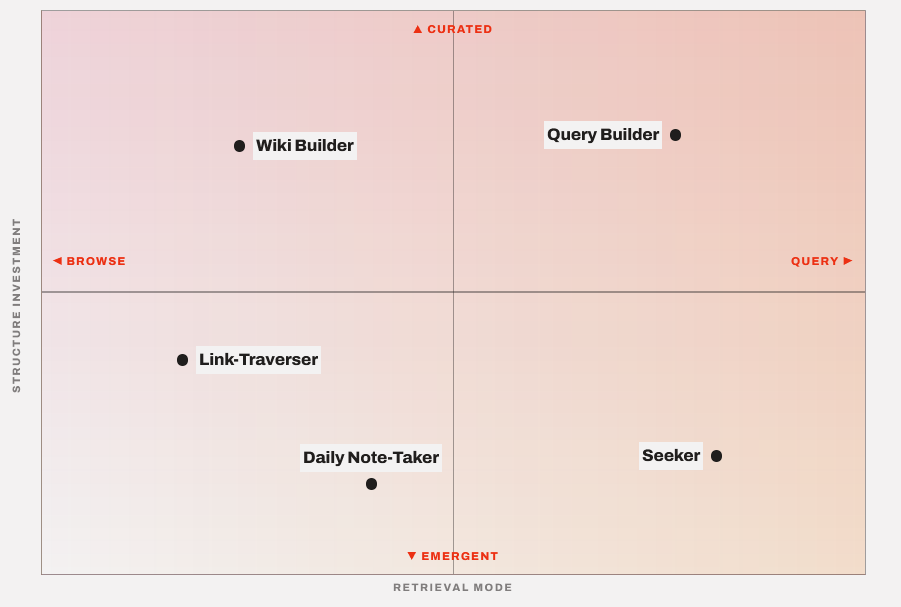

## Close your tab debt with discourse graphs

_This is no way to live_

Many researchers have established pipeline for accumulating potentially useful evidence and insights, but fewer ways of managing and exploiting these resources.

_Potentially useful ..._

The [discourse graph protocol](/docs/obsidian/fundamentals/what-is-a-discourse-graph) can be used to drive more intentional note taking and facilitate serendipitous discovery within an existing knowledge base.

## Getting started

If you’re already using Roam Research or another PKM platform, your first question might be “Can I integrate discourse graphs into my existing knowledge base?”

The answer is **yes**: your discourse nodes can coexist with your existing graph. The major considerations for a smooth integration are your organizational preferences and the format of your existing notes.

### Roam Research Organizational Patterns

The discourse graph plugin is compatible with most existing Roam Research use patterns.

_Roam Research use-patterns plotted by graph structure vs. retrieval strategy_

- **The Daily Notes Navigator**: Uses the Daily Notes Page as a hub to create a timestamped record of activity.

- **The Link Traverser**: Enters via a target page and uses its wikilinks to navigate to related content.

- **The Wiki Builder**: Creates topical hub pages with curated links (`[[Topic]]`) to create a wiki with a ToC.

- **The Query Builder**: Uses query dashboards as a view to the contents of their graph.

- **The Seeker**: Uses the full-text search to recall items entered into the graph.

- **The Oubliette Builder**: Throws everything into a digital dungeon as an act of cognitive cleansing and never looks at it again.
  
  _Just kidding, we don't support this usage pattern_

### Are discourse graphs right for you?

The discourse graph plugin handles the work of designing a structure for your knowledge base so that you can focus on entering ideas and observations -- and later, on creating and discovering relations.

The key to the discourse graph workflow is that it supports both _atomicity_(capturing discrete discourse units as questions, claims, and evidence) and _progressive formalization_ (applying a candidate classification up front and incrementally refining it into a discourse node).

You can decide how much effort you want to invest in structure up front: Querybuilder-type users may be more comfortable composing discourse nodes at first write, while Daily note-takers may prefer to apply the provisional & low-commitment candidate nodes at first capture and revise them later. In both cases, the discourse grammar offers a schema that makes your graph more queryable, navigable, & searchable.

**CLM:** Discourse graphs are right for you if you can consistently apply the fixed relational grammar (supports/opposes/addresses/ QUE/CLM/EVD) to notes that you want to revisit and re-use.

In research and synthesis work, the effort of structuring your graph is reduced by applying the discourse graph schema and amortized over time by making your notes more re-usable. For this to result in a time savings and productivity increase for you, you have to apply a minimal structure to notes you want to incorporate into your graph. The primary cost is _judgment_.

### Transforming existing notes into discourse nodes

### Best practices for node conversion

### Promoting candidate nodes

## Creating new discourse nodes

## Creating relations

_Now you know how to **make** a knowledge base, you just don't know how to **use** the knowledge base. And that's really the most important part: the using. Anybody can just make them_

## What else would you like to do?

- [Synthesize Insights from the Literature](/docs/roam/use-cases/synthesize-insights-from-literature)
- [Share your ideas & research](/docs/roam/use-cases/share-your-ideas-and-research)
- [Track your Projects & Experiments](/docs/roam/use-cases/track-your-projects-and-experiments)
