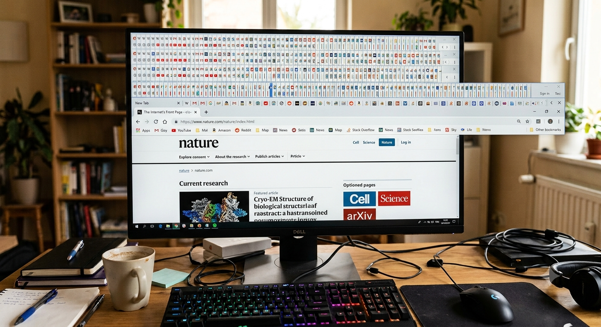
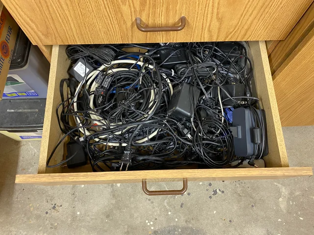

## Close your tab debt with discourse graphs

_This is no way to live_

Many researchers have established pipeline for accumulating potentially useful evidence and insights, but fewer ways of managing and exploiting these resources.

_Potentially useful ..._

The [discourse graph protocol](/docs/obsidian/fundamentals/what-is-a-discourse-graph) can be used to drive more intentional note taking and to accentuate serendipitous discovery within an existing knowledge base.

## Getting started

## Organizing your graph

## Transforming existing notes into discourse nodes

### Best practices for node conversion

### Promoting candidate nodes

## Creating new discourse nodes

## Creating relations

_Now you know how to **build** a knowledge base, you just don't know how to **use** the knowledge base. And that's really the most important part: the using. Anybody can just make them_

## What else would you like to do?

- [Synthesize Insights from the Literature](/docs/roam/use-cases/synthesize-insights-from-literature)
- [Share your ideas & research](/docs/roam/use-cases/share-your-ideas-and-research)
- [Track your Projects & Experiments](/docs/roam/use-cases/track-your-projects-and-experiments)
